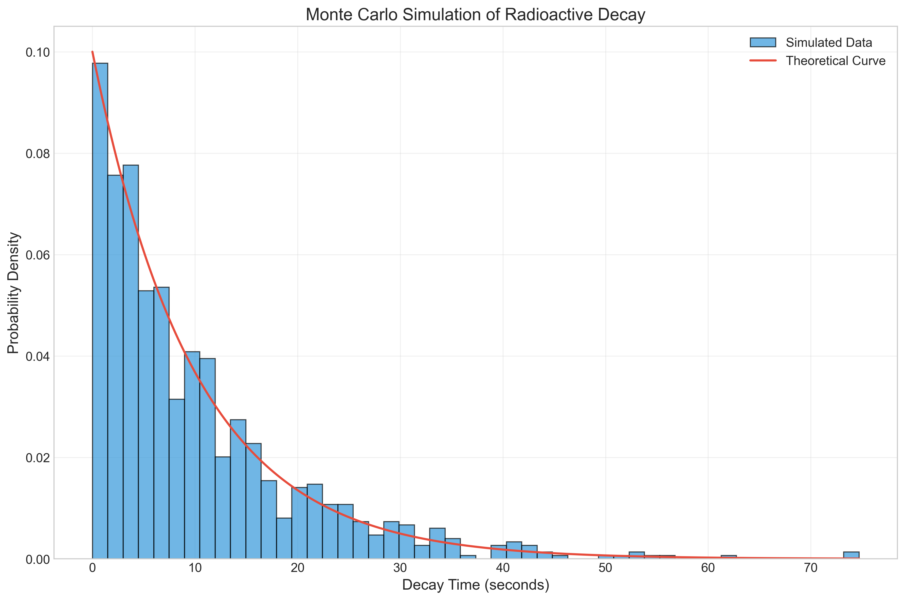
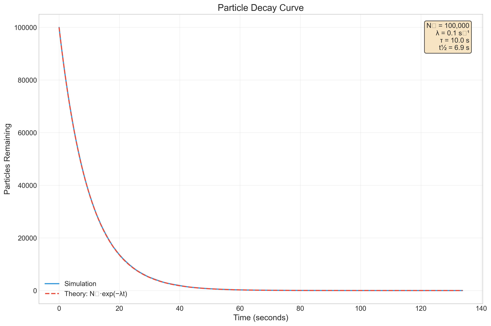
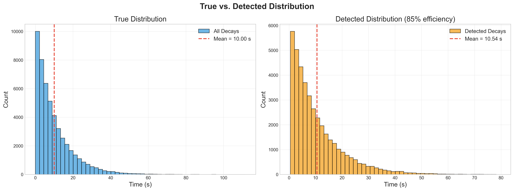
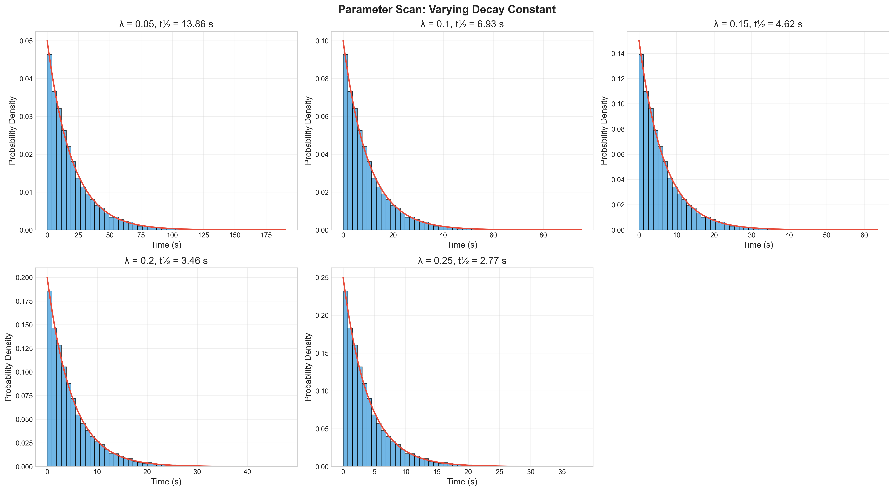
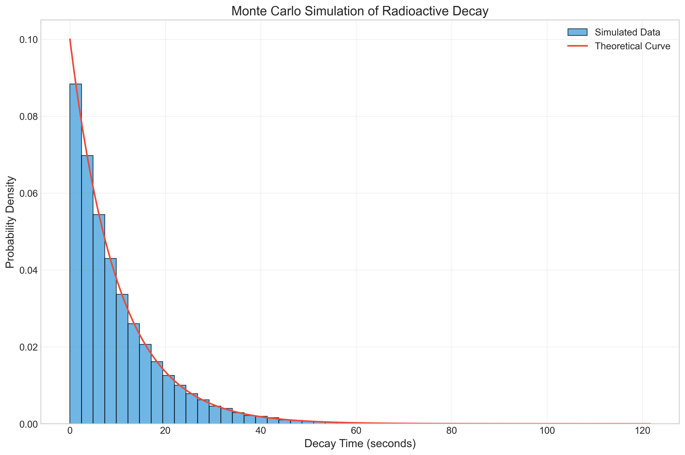
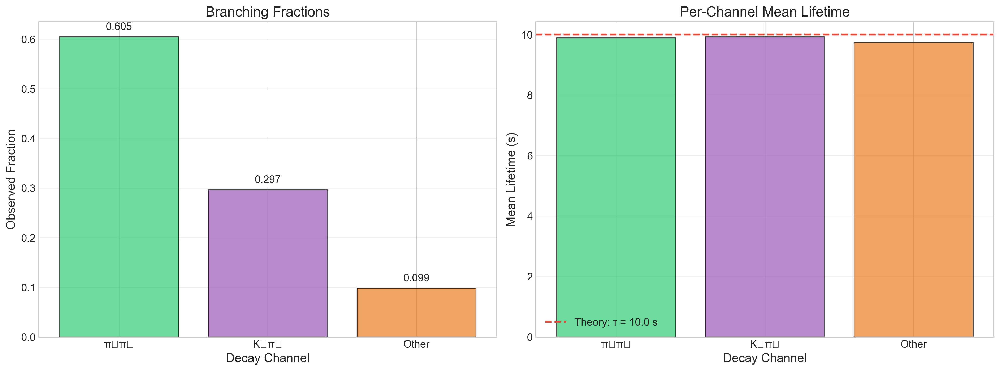
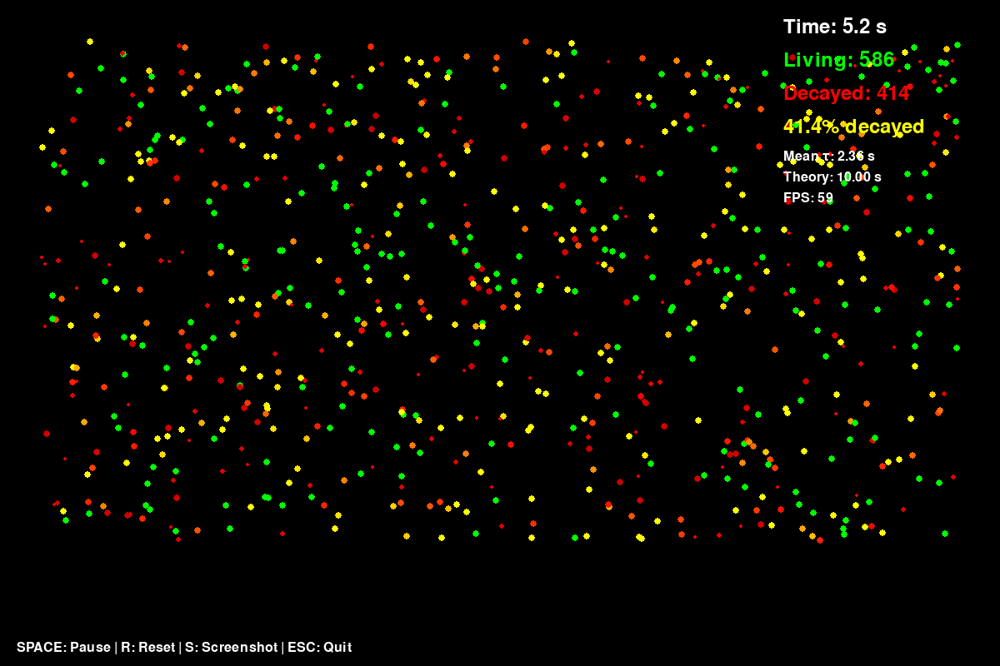

# Monte Carlo Simulation of Radioactive Particle Decay


A research-grade Monte Carlo simulation of exponential particle decay, featuring
multi-channel branching ratios, realistic detector modelling, rigorous statistical
analysis, and three distinct visualisation modes (2-D grid, 3-D rotating cloud,
real-time interactive).

Developed for the **KEK Summer Student Program 2026** application.

---

## Physics Background

Radioactive decay is a quantum-mechanical process in which an unstable nucleus
(or subatomic particle) transforms into a lighter system. The number of surviving
particles follows

$$N(t) = N_0 \, e^{-\lambda\,t}$$

where $\lambda$ is the decay constant and $\tau = 1/\lambda$ is the mean lifetime.
This project uses the Monte Carlo method—drawing random samples from the
corresponding exponential distribution—to reproduce the decay curve, complete
with realistic statistical fluctuations.

See [docs/PHYSICS_BACKGROUND.md](docs/PHYSICS_BACKGROUND.md) for a longer,
accessible explanation.

---

## Features

- ✅ **Basic exponential decay** — generate and analyse decay-time distributions
- ✅ **Multi-channel decay** — branching ratios with per-channel statistics
- ✅ **Detector effects** — efficiency, acceptance cuts, resolution smearing
- ✅ **Statistical analysis** — mean lifetime, χ² goodness-of-fit, bootstrap CI
- ✅ **Publication-quality plots** — histograms, decay curves, parameter scans
- ✅ **2-D grid animation** — particles disappearing on a colour-coded lattice
- ✅ **3-D particle cloud** — rotating Matplotlib animation with fading
- ✅ **Real-time interactive** — Pygame simulation with keyboard controls

---

## Installation

```bash
# Clone the repository
git clone https://github.com/MussabPro/Monte-Carlo-Simulation-of-Radioactive-Decay.git
cd Monte-Carlo-Simulation-of-Radioactive-Decay

# (Recommended) create and activate a virtual environment
python -m venv .venv
source .venv/bin/activate

# Install dependencies
pip install -r requirements.txt
```

---

## Quick Start

```python
from src.basic_simulation import run_basic_simulation
from src.visualization import plot_decay_histogram

results = run_basic_simulation(n_particles=10_000, decay_constant=0.1)
print(f"Mean lifetime: {results['mean_lifetime']:.2f} "
      f"(theory: {results['theoretical_mean']:.2f})")

plot_decay_histogram(results["decay_times"], 0.1, show=True)
```


*Figure 1: Simple exponential decay distribution generated with 10,000 particles.*

---

## Usage Examples

Ready-to-run scripts live in `examples/`:

```bash
python examples/run_basic.py            # Simple 1 000-particle simulation
python examples/run_multichannel.py     # 3-channel B-meson-style decay
python examples/run_full_analysis.py    # Full pipeline with detector effects
python examples/generate_animations.py  # Generate 2-D and 3-D animations
```

All outputs are saved to `results/`.

---

## Visualizations & Results

Below are examples of the results generated by the simulation scripts, showcasing basic decay distributions, multi-channel branching, detector effects, and real-time animations.

### 1. Statistical Analysis & Detector Modelling
The simulation produces publication-quality plots using Matplotlib, including lifetime fits, parameter sensitivity scans, and comparisons between ideal and 'measured' distributions.

| Analysis Type | Plot Output |
| :--- | :--- |
| **Full Decay Curve**: Fits the generated decay times to an exponential model, retrieving the mean lifetime with statistical uncertainties. |  |
| **Detector Effects Comparison**: Comparison of the 'true' distribution versus the distribution after efficiency cuts and resolution smearing. |  |
| **Parameter Sensitivity**: Scan of decay constants illustrating the simulation's robustness across different physics parameters. |  |
| **Population Distribution**: Histogram of decay times for a large sample (100,000+ particles). |  |

### 2. Multi-channel Decay
Comparison of different decay channels with pre-defined branching ratios (e.g., simulating B-meson decay branches).


*Figure 2: Multi-channel branching ratios showing the relative frequency of different decay paths.*

### 3. Animations & Real-time Visualization
Interactive and dynamic visualizations enhance the understanding of the stochastic nature of radioactive decay.

- **Lattice 2-D Grid Simulation**: A 2-D grid representation where particles (pixels) change state (decay) over time. [🎥 View 2D Animation](results/animations/grid_2d_20260221_023900.mp4)
- **Rotating 3-D Particle Space**: A dynamic 3-D cloud of particles that fade and disappear according to the decay law. [🎥 View 3D Animation](results/animations/space_3d_20260221_023919.mp4)
- **Real-time Interactive Mode**: A Pygame-based simulation allowing for real-time interaction and observation of the decay process.


*Figure 3: Screenshot of the real-time interactive simulation interface.*

---

## Project Structure

```
monte-carlo-decay/
├── README.md
├── config.py                 # Centralised configuration
├── requirements.txt
├── LICENSE
├── CITATION.cff
│
├── src/                      # Core library
│   ├── basic_simulation.py       Exponential decay generation
│   ├── multichannel_simulation.py  Branching-ratio channels
│   ├── detector_effects.py       Efficiency & smearing
│   ├── statistics.py             χ², bootstrap, comparison
│   ├── visualization.py         Publication-quality plots
│   └── utils.py                 Helpers (RNG, timing, I/O)
│
├── animations/               # Visualisation modules
│   ├── grid_2d_animation.py      2-D lattice animation
│   ├── space_3d_animation.py     3-D rotating cloud
│   └── realtime_interactive.py   Pygame interactive sim
│
├── examples/                 # Runnable demo scripts
│   ├── run_basic.py
│   ├── run_multichannel.py
│   ├── run_full_analysis.py
│   └── generate_animations.py
│
├── tests/                    # pytest suite (53 tests)
│   ├── test_basic_simulation.py
│   ├── test_statistics.py
│   └── test_physics_accuracy.py
│
├── docs/
│   ├── PHYSICS_BACKGROUND.md     Accessible physics explanation
│   ├── PERFORMANCE.md            Benchmarks & system specs
│   └── CONTRIBUTING.md           Setup & contribution guide
│
└── results/
    ├── plots/                    Generated plots
    ├── animations/               Generated videos / GIFs
    └── benchmarks/               Performance data
```

---

## Performance Benchmarks

| N Particles | Generation | Full Pipeline | Memory |
|------------:|-----------:|--------------:|-------:|
| 1,000 | < 0.01 s | ~ 0.02 s | ~ 15 MB |
| 10,000 | ~ 0.01 s | ~ 0.08 s | ~ 45 MB |
| 100,000 | ~ 0.05 s | ~ 0.60 s | ~ 380 MB |

See [docs/PERFORMANCE.md](docs/PERFORMANCE.md) for details and instructions to
benchmark on your own system.

---

## Physics Applications

This simulation is directly relevant to **flavour physics** experiments such as
Belle II at KEK, where precise measurement of B-meson decay-time distributions
is essential for:

- Extracting CKM matrix elements
- Testing CP violation in the Standard Model
- Searching for new physics through lifetime anomalies

The detector-effects module (efficiency, acceptance, smearing) mirrors the
real corrections applied in experimental analyses.

---

## Running Tests

```bash
python -m pytest tests/ -v
```

53 tests covering physics accuracy, statistical properties, edge cases,
reproducibility, and input validation.

---

## Contributing

See [docs/CONTRIBUTING.md](docs/CONTRIBUTING.md) for setup instructions, coding
standards, and how to submit benchmark results.

---

## License

Released under the [MIT License](LICENSE).

---

## Author

**Mussab Omair**
University of Gujrat
me@mussab.tech | mussabomair16@gmail.com
Developed for KEK Summer Student Program 2026 Application

---

## Acknowledgements

- [NumPy](https://numpy.org/) — vectorised random-number generation
- [SciPy](https://scipy.org/) — statistical tests
- [Matplotlib](https://matplotlib.org/) — publication-quality plots and animations
- [Pygame](https://www.pygame.org/) — real-time interactive visualisation
- [Particle Data Group](https://pdg.lbl.gov/) — reference decay data
